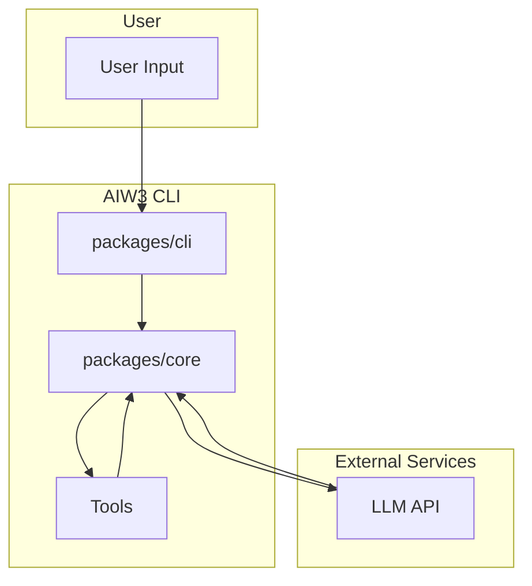

<div align="center">

<h4>An open-source AI agent compatible with multiple LLM models.</h4>

[English](./README.md) | [简体中文](./README.zh-CN.md)

</div>

This repository contains AIW3, a command-line AI workflow tool that connects to your tools, understands your code, and accelerates your workflows. It supports multiple LLM providers including Gemini, OpenAI, and any custom LLM API that follows OpenAI's API format.

## Core Features

- **Codebase Interaction**: Query and edit large codebases using advanced LLM capabilities with large context windows.
- **Multimodality**: Generate new apps from PDFs or sketches.
- **Workflow Automation**: Automate operational tasks, like querying pull requests or handling complex rebases.
- **Extensibility**: Use tools and MCP servers to connect new capabilities.
- **LLM Flexibility**: Configure and use your preferred LLM provider through simple environment variables.
- **Seamless Switching**: Switch between different LLM providers without changing your workflow.

## General Architecture

The AIW3 CLI is composed of two main packages and a suite of tools:

1.  **CLI package (`packages/cli`):** The user-facing portion of the CLI, handling input, output, and user experience.
2.  **Core package (`packages/core`):** The backend that orchestrates interactions with the LLM API and manages tool execution.
3.  **Tools (`packages/core/src/tools/`):** Modules that extend the capabilities of the LLM to interact with the local environment.

### Architecture Diagram



## Usage

### Quickstart

1.  **Prerequisites:** Ensure you have [Node.js version 20](https://nodejs.org/en/download) or higher installed.
2.  **Run the CLI:** Execute the following command in your terminal:

    ```bash
    npx aiw3
    ```

### Examples

Once the CLI is running, you can start interacting with it from your shell.

You can start a project from a new directory:

```sh
cd new-project/
aiw3
> Write me a Discord bot that answers questions using a FAQ.md file I will provide
```

Or work with an existing project:

```sh
git clone https://github.com/tonycai/aiw3-llm-cli.git
cd aiw3
aiw3
> Give me a summary of all of the changes that went in yesterday
```

## Configuration

AIW3 supports connecting to any OpenAI-compatible LLM API. You can configure your preferred LLM using these environment variables:

```bash
# Enable custom LLM support
export USE_CUSTOM_LLM=true 

export CUSTOM_LLM_PROVIDER="openai"  # LLM provider
export CUSTOM_LLM_API_KEY="your-api-key"     # Your LLM provider API key
export CUSTOM_LLM_ENDPOINT="https://api.your-llm-provider.com/v1"  # API endpoint
export CUSTOM_LLM_MODEL_NAME="your-model-name"  # Model name

# Optional parameters
export CUSTOM_LLM_TEMPERATURE=0.7  # Temperature (default: 0)
export CUSTOM_LLM_MAX_TOKENS=8192  # Max tokens (default: 8192)
export CUSTOM_LLM_TOP_P=1          # Top P (default: 1)
```

When these variables are set, AIW3 will use your custom LLM instead of the default Gemini model.

## Deployment

You can install the CLI globally to make the `aiw3` command available from any directory:

```bash
npm install -g .
```

## Model Compatibility

This project has been tested with various models from different providers. Here are the results:

| Model | COT | Simple | Tool | MCP | Complex | Multimodal | Token |
| --- | --- | --- | --- | --- | --- | --- | --- |
| 【Google】Gemini-2.5-pro | ✅ | ✅ | ✅ | ✅ | ✅ | ✅ | ✅ |
| 【OpenRouter】Claude Sonnet 4 | ✅ | ✅ | ✅ | ✅ | ✅ | ✅ | ✅ |
| 【OpenRouter】Gpt-4.1 | ✅ | ✅ | ✅ | ✅ | ✅ | ✅ | ✅ |
| 【OpenRouter】Grok-4 | ✅ | ✅ | ✅ | ✅ | ✅ | ✅ | ✅ |
| 【Volcengine】Doubao-Seed-1.6 | ✅ | ✅ | ✅ | ✅ | ✅ | ✅ | ✅ |
| 【Bailian】Qwen3-Plus | ✅ | ✅ | ✅ | ✅ | ✅ | ✅ | ✅ |
| 【Moonshot】kimi-k2 | ✅ | ✅ | ✅ | ✅ | ✅ | ❌ | ✅ |
| 【Volcengine】DeepSeek-R1 | ✅ | ✅ | ✅ | ✅ | ✅ | ❌ | ✅ |
| 【Siliconflow】DeepSeek-R1 | ✅ | ✅ | ✅ | ✅ | ✅ | ❌ | ✅ |
| 【Volcengine】Doubao-1.5-Pro | ❌ | ✅ | ✅ | ✅ | ⚠️ | ❌ | ✅ |
| 【Volcengine】DeepSeek-V3 | ❌ | ✅ | ✅ | ✅ | ⚠️ | ❌ | ✅ |
| 【Bailian】Qwen3-235b-a22b | ✅ | ✅ | ✅ | ✅ | ⚠️ | ❌ | ✅ |
| 【vLLM】Qwen2.5-7B-Instruct | ❌ | ✅ | ✅ | ✅ | ⚠️ | ❌ | ✅ |
| 【vLLM】DeepSeek-R1-32B | ✅ | ✅ | ✅ | ✅ | ⚠️ | ❌ | ✅ |
| 【Ollama】Qwen2.5-7B-Instruct | ❌ | ✅ | ✅ | ✅ | ⚠️ | ❌ | ✅ |

## Next steps

- Learn how to [contribute to or build from the source](./CONTRIBUTING.md).
- Explore the available **[CLI Commands](./docs/cli/commands.md)**.
- If you encounter any issues, review the **[Troubleshooting guide](./docs/troubleshooting.md)**.
- For more comprehensive documentation, see the [full documentation](./docs/index.md).