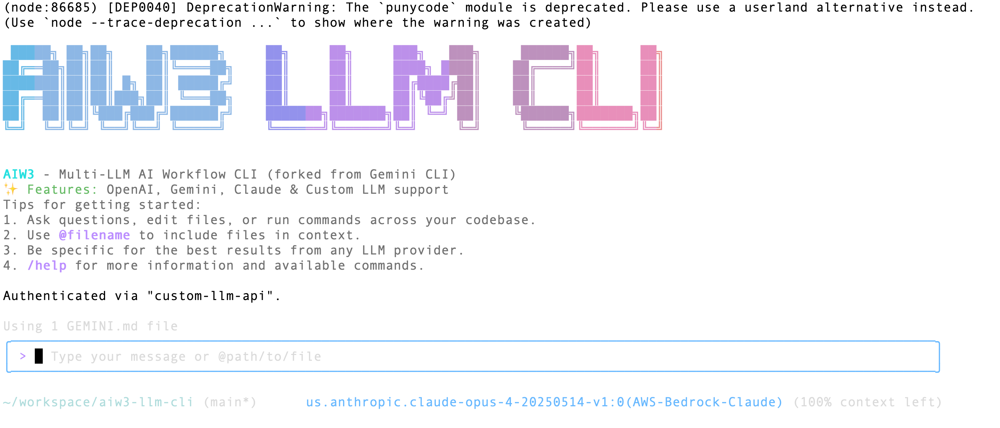

<div align="center">

<h4>An open-source AI agent compatible with multiple LLM models.</h4>

[English](./README.md) | [简体中文](./README.zh-CN.md)

</div>

# AIW3 - Multi-LLM AI Workflow CLI

AIW3 is a powerful command-line AI workflow tool that connects to your tools, understands your code, and accelerates your development workflows. Originally forked from Google's Gemini CLI, AIW3 has been enhanced to support multiple LLM providers including Gemini, OpenAI, and any custom LLM API that follows OpenAI's format.

## ✨ Key Features

- **🔗 Multi-LLM Support**: Connect to Gemini, OpenAI, Claude, or any OpenAI-compatible API
- **🛠️ Rich Tool Ecosystem**: 6 core tools for file operations, content search, and data management
- **🔌 MCP Integration**: Support for Model Context Protocol (MCP) servers to extend capabilities
- **📝 Codebase Intelligence**: Query and edit large codebases with advanced LLM capabilities
- **🖼️ Multimodal Support**: Process images, PDFs, and generate applications from sketches
- **🤖 Workflow Automation**: Automate complex development tasks like PR analysis and code refactoring
- **📦 Programmatic API**: Use AIW3Agent class to integrate AI capabilities into your applications
- **🔒 Secure Execution**: Containerized sandboxing for safe tool execution
- **🎨 Extensible Architecture**: Plugin system for custom tools and integrations

## 🏗️ Architecture

AIW3 is built as a TypeScript monorepo with a modular architecture:

```
┌─────────────────┐    ┌─────────────────┐    ┌─────────────────┐
│   packages/cli  │◄──►│  packages/core  │◄──►│     Tools       │
│   (Frontend)    │    │   (Backend)     │    │   Ecosystem     │
│                 │    │                 │    │                 │
│ • User Interface│    │ • LLM APIs      │    │ • File System   │
│ • Command Parse │    │ • Tool Registry │    │ • Shell Exec    │
│ • Display       │    │ • State Mgmt    │    │ • Web Fetch     │
│ • Themes        │    │ • Security      │    │ • MCP Servers   │
└─────────────────┘    └─────────────────┘    └─────────────────┘
         ▲                       ▲                       ▲
         │                       │                       │
         ▼                       ▼                       ▼
┌─────────────────────────────────────────────────────────────────┐
│                    External Services                            │
│                                                                 │
│  • LLM APIs (Gemini, OpenAI, Claude, etc.)                    │
│  • Web Services • Git Repositories • Local System             │
└─────────────────────────────────────────────────────────────────┘
```

### Core Components

1. **CLI Package (`packages/cli`)**
   - React-based terminal UI with Ink framework
   - Command parsing and user interaction
   - Theme system and display rendering
   - Authentication and configuration management

2. **Core Package (`packages/core`)**
   - Multi-LLM content generation with OpenAI compatibility
   - Tool registry and execution engine
   - Security and sandboxing
   - State management and session handling

3. **Tool Ecosystem (`packages/core/src/tools/`)**
   - **File Operations**: `list_directory`, `read_file`, `read_many_files`
   - **Content Search**: `search_file_content`, `glob`
   - **Memory Management**: `save_memory`
   - **MCP Tools**: Dynamic tool discovery from MCP servers

## 🚀 Quick Start

### Prerequisites
- Node.js 20 or higher
- npm or yarn package manager
- API key for your chosen LLM provider

### Installation Methods

#### Method 1: NPX (Quick Test)
```bash
# Test directly without installation
npx aiw3 --help
```

#### Method 2: Global Install (Not Currently Working)
```bash
# Note: npm global install has build issues
# Use Method 3 for reliable installation
npm install -g aiw3  # May fail due to build scripts
```

#### Method 3: Build from Source (Recommended)

```bash
# Clone the repository
git clone https://github.com/tonycai/aiw3-llm-cli.git
cd aiw3-llm-cli

# Install dependencies (skip problematic scripts)
npm install --ignore-scripts

# Generate required files
node scripts/generate-git-commit-info.js

# Build packages individually
cd packages/core && npm run build
cd ../cli && npm run build
cd ../../

# Create executable bundle
node esbuild.config.js

# Set up global command
mkdir -p ~/bin
echo '#!/bin/bash\nnode "'$(pwd)'/bundle/gemini.js" "$@"' > ~/bin/aiw3
chmod +x ~/bin/aiw3

# Add to PATH (add to ~/.zshrc or ~/.bashrc for persistence)
export PATH="$HOME/bin:$PATH"
```

### First Run

```bash
# Test installation
aiw3 --version

# Configure your LLM (see Configuration section below)
# Then test with a simple prompt
aiw3 -p "Hello! What tools are available?"
```

## ⚙️ Configuration

### Step 1: Create Environment Configuration

Create a `.env` file in your project directory or set environment variables:

#### For OpenAI (Recommended for beginners):
```bash
# .env file
USE_CUSTOM_LLM=true
CUSTOM_LLM_PROVIDER=openai
CUSTOM_LLM_API_KEY=your-openai-api-key-here
CUSTOM_LLM_ENDPOINT=https://api.openai.com/v1
CUSTOM_LLM_MODEL_NAME=gpt-4o
CUSTOM_LLM_TEMPERATURE=0.7
CUSTOM_LLM_MAX_TOKENS=4096
CUSTOM_LLM_TOP_P=1
```

#### For Gemini (Original):
```bash
# .env file
USE_CUSTOM_LLM=false
GEMINI_API_KEY=your-gemini-api-key-here
```

### Step 2: Configure Settings (Optional)

Create `.gemini/settings.json` to customize behavior:

```json
{
  "selectedAuthType": "custom-llm-api",
  "mcpServers": {}
}
```

### Provider Examples

<details>
<summary>🔹 OpenAI GPT Models</summary>

```bash
USE_CUSTOM_LLM=true
CUSTOM_LLM_API_KEY="sk-proj-your-api-key-here"
CUSTOM_LLM_ENDPOINT="https://api.openai.com/v1"
CUSTOM_LLM_MODEL_NAME="gpt-4o"  # or gpt-4, gpt-3.5-turbo
CUSTOM_LLM_PROVIDER="openai"
```

**Models tested:**
- `gpt-4o` - 128k context ✅ (Recommended)
- `gpt-4` - 8k context ⚠️ (May hit token limits)
- `gpt-3.5-turbo` - 4k context ⚠️ (Limited for complex tasks)
</details>

<details>
<summary>🔹 OpenRouter (Claude, GPT, Llama, etc.)</summary>

```bash
USE_CUSTOM_LLM=true
CUSTOM_LLM_API_KEY="sk-or-v1-your-key-here"
CUSTOM_LLM_ENDPOINT="https://openrouter.ai/api/v1"
CUSTOM_LLM_MODEL_NAME="anthropic/claude-3-sonnet"
CUSTOM_LLM_PROVIDER="openrouter"
```

**Popular models:**
- `anthropic/claude-3-sonnet` - High quality ✅
- `openai/gpt-4` - OpenAI via OpenRouter
- `meta-llama/llama-3.1-70b` - Open source option
</details>

<details>
<summary>🔹 Local/Self-hosted (vLLM, Ollama, etc.)</summary>

```bash
USE_CUSTOM_LLM=true
CUSTOM_LLM_API_KEY="not-needed"
CUSTOM_LLM_ENDPOINT="http://localhost:8000/v1"
CUSTOM_LLM_MODEL_NAME="llama-3.1-70b"
CUSTOM_LLM_PROVIDER="vllm"
```
</details>

### Step 3: Load Configuration

```bash
# Load from .env file
source .env
aiw3 -p "Test configuration"

# Or set temporarily
export USE_CUSTOM_LLM=true
export CUSTOM_LLM_API_KEY="your-key"
# ... other variables
aiw3
```

## 🧰 Built-in Tools

AIW3 includes 6 core tools for development workflows:

### File System Tools
- **`list_directory`**: Browse directory contents with optional filtering
- **`read_file`**: Read single files with line range support and multimodal capabilities
- **`read_many_files`**: Batch read multiple files using glob patterns

### Content Discovery
- **`search_file_content`**: Search file contents with regex patterns
- **`glob`**: Find files matching specific patterns, sorted by modification time

### Data Management
- **`save_memory`**: Store facts in long-term memory for personalized assistance

### Advanced Features
- **MCP Tool Discovery**: Automatically discover and integrate external tools
- **Custom Tool Support**: Define project-specific tools
- **Sandboxed Execution**: Safe command execution in containers (when available)

## 🔧 Usage Examples

### Command Line Mode
```bash
# Quick analysis
aiw3 -p "What is the structure of this project?"

# File operations  
aiw3 -p "Find all TypeScript files and summarize their purpose"

# Code review
aiw3 -p "Review the package.json and suggest improvements"
```

### Interactive Mode
```bash
aiw3
> What files are in this directory?
> Read the README.md file and summarize it
> Find all TODO comments in the codebase
> /quit
```

### Programmatic API

```javascript
import { AIW3Agent } from 'aiw3';

const agent = new AIW3Agent({
  model: 'gpt-4o',
  apiKey: 'your-api-key',
  endpoint: 'https://api.openai.com/v1',
  log: true,
  readonly: false
});

const response = await agent.run('Analyze this project structure');
console.log(response);
```

## 🔒 Security Features

- **Environment-based Configuration**: Keep API keys in environment variables
- **Read-only Mode**: Disable file modifications for safe analysis
- **Tool Restrictions**: Configure allowed/blocked tools per project
- **Sandboxed Execution**: Tools run in containers when Docker/Podman available
- **User Confirmation**: Destructive operations require explicit approval

## 🛠️ Troubleshooting

### Common Issues

#### 1. **Token Limit Exceeded**
```
Error: context_length_exceeded
```
**Solution**: Use a model with larger context window:
```bash
CUSTOM_LLM_MODEL_NAME=gpt-4o  # Instead of gpt-4
CUSTOM_LLM_MAX_TOKENS=4096    # Reduce if still too large
```

#### 2. **MCP Server Connection Failures**
```
failed to start or connect to MCP server 'puppeteer'
```
**Solution**: Disable problematic MCP servers:
```json
// .gemini/settings.json
{
  "mcpServers": {}
}
```

#### 3. **Build Issues During Installation**
```
Error: Cannot find module 'node:path'
```
**Solution**: Use the build from source method:
```bash
npm install --ignore-scripts
node scripts/generate-git-commit-info.js
# Continue with manual build process
```

#### 4. **API Authentication Errors**
```
API Error: 401 Incorrect API key provided
```
**Solutions**:
- Verify your API key is correct and active
- Check the endpoint URL matches your provider
- Ensure environment variables are loaded: `source .env`

#### 5. **Command Not Found**
```
aiw3: command not found
```
**Solution**: Add to PATH:
```bash
echo 'export PATH="$HOME/bin:$PATH"' >> ~/.zshrc
source ~/.zshrc
```

### Debug Mode

```bash
# Enable verbose logging
aiw3 --debug -p "your prompt"

# Check configuration
aiw3 --help
```

## 📊 Model Compatibility

AIW3 has been extensively tested across multiple LLM providers and models:

| Model | COT¹ | Simple | Tool | MCP | Complex | Multimodal | Token |
|-------|-----|--------|------|-----|---------|------------|--------|
| **Google Gemini 2.5 Pro** | ✅ | ✅ | ✅ | ✅ | ✅ | ✅ | ✅ |
| **OpenAI GPT-4o** | ✅ | ✅ | ✅ | ✅ | ✅ | ✅ | ✅ |
| **OpenRouter Claude Sonnet 4** | ✅ | ✅ | ✅ | ✅ | ✅ | ✅ | ✅ |
| **OpenRouter GPT-4** | ✅ | ✅ | ✅ | ✅ | ✅ | ✅ | ✅ |
| **OpenAI GPT-4** | ⚠️² | ✅ | ✅ | ✅ | ⚠️ | ✅ | ✅ |
| **Volcengine Doubao-Seed-1.6** | ✅ | ✅ | ✅ | ✅ | ✅ | ✅ | ✅ |
| **Bailian Qwen3-Plus** | ✅ | ✅ | ✅ | ✅ | ✅ | ✅ | ✅ |
| **Moonshot Kimi-K2** | ✅ | ✅ | ✅ | ✅ | ✅ | ❌ | ✅ |
| **DeepSeek R1** | ✅ | ✅ | ✅ | ✅ | ✅ | ❌ | ✅ |
| **vLLM Qwen2.5-7B** | ❌ | ✅ | ✅ | ✅ | ⚠️ | ❌ | ✅ |
| **Ollama Local Models** | ❌ | ✅ | ✅ | ✅ | ⚠️ | ❌ | ✅ |

¹ **COT**: Chain of Thought reasoning support  
² **Warning**: GPT-4 (non-o) has 8k context limit, may hit token limits with complex tasks

**Legend**: ✅ Full Support | ⚠️ Partial Support | ❌ Not Supported

## 🛠️ Development & Deployment

### Build from Source

```bash
# Clone repository
git clone https://github.com/tonycai/aiw3-llm-cli.git
cd aiw3-llm-cli

# Install dependencies
npm install --ignore-scripts

# Generate required files
npm run generate

# Build packages
cd packages/core && npm run build
cd ../cli && npm run build
cd ../../

# Create production bundle
node esbuild.config.js

# Run tests
npm test
```

### Project Structure

```
aiw3-llm-cli/
├── packages/
│   ├── cli/                    # Frontend React application
│   └── core/                   # Backend logic and tools
├── scripts/                    # Build and utility scripts
├── docs/                       # Comprehensive documentation
├── integration-tests/          # End-to-end test suite
├── bundle/                     # Production builds
└── .github/                    # CI/CD workflows
```

### Container Deployment

```bash
# Build sandbox image
npm run build:sandbox

# Run in container
docker run --rm -it \
  -v $(pwd):/workspace \
  -e CUSTOM_LLM_API_KEY=your-key \
  aiw3:latest
```

## 📚 Documentation

- **[Architecture Overview](./docs/architecture.md)**: System design and components
- **[CLI Commands](./docs/cli/commands.md)**: Available commands and usage
- **[Tools Documentation](./docs/tools/index.md)**: Complete tool reference
- **[MCP Integration](./docs/tools/mcp-server.md)**: Model Context Protocol setup
- **[Configuration Guide](./docs/cli/configuration.md)**: Advanced configuration options
- **[Contributing Guide](./CONTRIBUTING.md)**: Development setup and guidelines
- **[Troubleshooting](./docs/troubleshooting.md)**: Common issues and solutions

## 🤝 Contributing

We welcome contributions! Please see our [Contributing Guide](./CONTRIBUTING.md) for details on:

- Development setup and workflow
- Code style and conventions  
- Testing requirements
- Pull request process

## 📄 License

This project is licensed under the Apache License 2.0. See [LICENSE](./LICENSE) for details.

## 🙏 Acknowledgments

- Built on the foundation of [Google's Gemini CLI](https://github.com/google-gemini/gemini-cli)
- Powered by the [Model Context Protocol](https://github.com/modelcontextprotocol) for extensibility
- Community-driven development and testing across multiple LLM providers

---

<div align="center">

**[⭐ Star this project](https://github.com/tonycai/aiw3-llm-cli)** | **[📖 Documentation](./docs/index.md)** | **[🐛 Report Issues](https://github.com/tonycai/aiw3-llm-cli/issues)**

Made with ❤️ by the AIW3 community

</div>