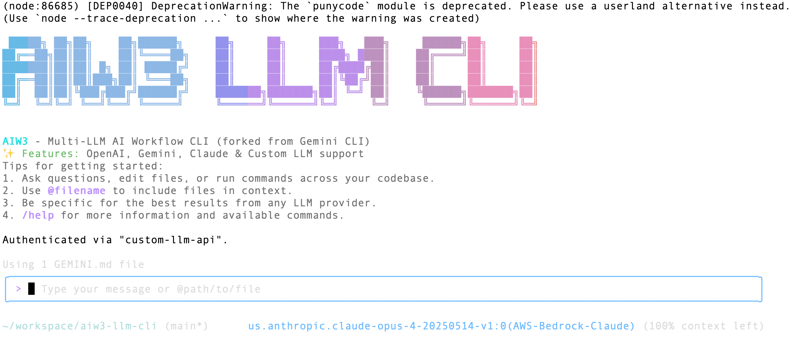

<div align="center">

<h4>兼容多种大语言模型（LLM）的开源 AI Agent CLI。</h4>

[English](./README.md) | [简体中文](./README.zh-CN.md)

</div>

# AIW3 - 多 LLM AI 工作流 CLI

AIW3 是一个强大的命令行 AI 工具，能够连接到您的工具，理解代码，加速开发流程。最初从 Google 的 Gemini CLI 派生，现支持多种 LLM 提供商，包括 Gemini、OpenAI，以及任何符合 OpenAI 格式的自定义 LLM API。

## ✨ 主要特性

- **🔗 多 LLM 支持**：连接到 Gemini、OpenAI、Claude 或任意 OpenAI 兼容 API
- **🛠️ 丰富工具生态**：提供 6 个核心工具，用于文件操作、内容搜索和数据管理
- **🔌 MCP 集成**：支持 Model Context Protocol (MCP) 服务器以扩展功能
- **📝 代码库智能**：利用先进 LLM 功能查询和编辑大型代码库
- **🖼️ 多模态支持**：处理图像、PDF，并从草图生成应用
- **🤖 工作流自动化**：自动化复杂开发任务，如 PR 分析和代码重构
- **📦 编程 API**：使用 AIW3Agent 类将 AI 功能集成到应用程序中
- **🔒 安全执行**：容器化沙盒确保工具安全运行
- **🎨 可扩展架构**：插件系统支持自定义工具和集成

## 🚀 快速开始

### 前提条件
- Node.js 20 或更高版本
- npm 或 yarn 包管理器
- 您选择的 LLM 提供商的 API 密钥

### 安装方法

#### 方法 1：NPX（快速测试）
```bash
npx aiw3 --help
```

#### 方法 2：全局安装（当前不可用）
```bash
npm install -g aiw3  # 可能因构建问题失败
```

#### 方法 3：从源码构建（推荐）

```bash
git clone https://github.com/tonycai/aiw3-llm-cli.git
cd aiw3-llm-cli
npm install --ignore-scripts
node scripts/generate-git-commit-info.js

cd packages/core && npm run build
cd ../cli && npm run build
cd ../../

node esbuild.config.js
mkdir -p ~/bin
echo '#!/bin/bash\nnode "'$(pwd)'/bundle/gemini.js" "$@"' > ~/bin/aiw3
chmod +x ~/bin/aiw3
export PATH="$HOME/bin:$PATH"
```

### 初次运行

```bash
aiw3 --version
aiw3 -p "Hello! What tools are available?"
```

## ⚙️ 配置

### 环境配置

创建 `.env` 文件或设置环境变量：

#### OpenAI（推荐初学者）
```bash
USE_CUSTOM_LLM=true
CUSTOM_LLM_PROVIDER=openai
CUSTOM_LLM_API_KEY=your-openai-api-key
CUSTOM_LLM_ENDPOINT=https://api.openai.com/v1
CUSTOM_LLM_MODEL_NAME=gpt-4o
CUSTOM_LLM_TEMPERATURE=0.7
CUSTOM_LLM_MAX_TOKENS=4096
CUSTOM_LLM_TOP_P=1
```

#### Gemini（原始）
```bash
USE_CUSTOM_LLM=false
GEMINI_API_KEY=your-gemini-api-key
```

### 设置（可选）

创建 `.gemini/settings.json`：

```json
{
  "selectedAuthType": "custom-llm-api",
  "mcpServers": {}
}
```

### 提供商示例

<details>
<summary>🔹 OpenAI GPT 模型</summary>

```bash
USE_CUSTOM_LLM=true
CUSTOM_LLM_API_KEY="sk-proj-your-api-key"
CUSTOM_LLM_ENDPOINT="https://api.openai.com/v1"
CUSTOM_LLM_MODEL_NAME="gpt-4o"
CUSTOM_LLM_PROVIDER="openai"
```

**测试模型：**
- `gpt-4o` - 128k 上下文（推荐）
- `gpt-4` - 8k 上下文（可能达到令牌限制）
- `gpt-3.5-turbo` - 4k 上下文（复杂任务有限）
</details>

<details>
<summary>🔹 OpenRouter（Claude, GPT, Llama 等）</summary>

```bash
USE_CUSTOM_LLM=true
CUSTOM_LLM_API_KEY="sk-or-v1-your-key"
CUSTOM_LLM_ENDPOINT="https://openrouter.ai/api/v1"
CUSTOM_LLM_MODEL_NAME="anthropic/claude-3-sonnet"
CUSTOM_LLM_PROVIDER="openrouter"
```

**热门模型：**
- `anthropic/claude-3-sonnet` - 高质量
- `openai/gpt-4` - 使用 OpenRouter 的 OpenAI
- `meta-llama/llama-3.1-70b` - 开源选项
</details>

<details>
<summary>🔹 本地/自托管（vLLM, Ollama 等）</summary>

```bash
USE_CUSTOM_LLM=true
CUSTOM_LLM_API_KEY="not-needed"
CUSTOM_LLM_ENDPOINT="http://localhost:8000/v1"
CUSTOM_LLM_MODEL_NAME="llama-3.1-70b"
CUSTOM_LLM_PROVIDER="vllm"
```
</details>

### 加载配置

```bash
source .env
aiw3 -p "Test configuration"
```

## 🧰 内置工具

AIW3 包括 6 个核心工具：

- **`list_directory`**：目录浏览
- **`read_file`**：文件读取
- **`read_many_files`**：批量读取
- **`search_file_content`**：内容搜索
- **`glob`**：文件查找
- **`save_memory`**：事实存储

## 🔧 使用示例

### 命令行模式
```bash
aiw3 -p "What is the structure of this project?"
```

### 交互模式
```bash
aiw3
> What files are in this directory?
```

### 编程 API

```javascript
import { AIW3Agent } from 'aiw3';

const agent = new AIW3Agent({
  model: 'gpt-4o',
  apiKey: 'your-api-key',
  endpoint: 'https://api.openai.com/v1',
});

const response = await agent.run('Analyze this project structure');
console.log(response);
```

## 🔒 安全特性

- **环境配置**：API 密钥保存在环境变量
- **只读模式**：禁用文件修改
- **工具限制**：配置允许/阻止的工具
- **沙盒执行**：容器中安全运行
- **用户确认**：破坏性操作需批准

## 🛠️ 故障排除

### 常见问题

#### 令牌限制超出
```
Error: context_length_exceeded
```
**解决方案**：使用更大上下文窗口的模型。
```bash
CUSTOM_LLM_MODEL_NAME=gpt-4o
```

#### MCP 服务器连接失败
```
failed to start or connect to MCP server 'puppeteer'
```
**解决方案**：禁用 MCP 服务器：
```json
{
  "mcpServers": {}
}
```

#### 安装期间的构建问题
```
Error: Cannot find module 'node:path'
```
**解决方案**：从源码构建：
```bash
npm install --ignore-scripts
```

#### API 认证错误
```
API Error: 401 Incorrect API key provided
```
**解决方案**：
- 验证 API 密钥
- 检查端点 URL
- 确保加载环境变量：`source .env`

#### 命令未找到
```
aiw3: command not found
```
**解决方案**：添加到 PATH：
```bash
echo 'export PATH="$HOME/bin:$PATH"' >> ~/.zshrc
source ~/.zshrc
```

### 调试模式

```bash
aiw3 --debug -p "your prompt"
```

## 📚 文档

- **[架构概览](./docs/architecture.md)**
- **[CLI 命令](./docs/cli/commands.md)**
- **[工具文档](./docs/tools/index.md)**
- **[MCP 集成](./docs/tools/mcp-server.md)**
- **[配置指南](./docs/cli/configuration.md)**
- **[贡献指南](./CONTRIBUTING.md)**
- **[故障排除](./docs/troubleshooting.md)**

## 🤝 贡献

欢迎贡献！请参阅[贡献指南](./CONTRIBUTING.md)了解详情。

## 📄 许可证

本项目根据 Apache License 2.0 许可。详见 [LICENSE](./LICENSE)。

## 🙏 致谢

- 基于 [Google 的 Gemini CLI](https://github.com/google-gemini/gemini-cli)
- 由 [Model Context Protocol](https://github.com/modelcontextprotocol) 提供可扩展性
- 社区驱动开发和跨多个 LLM 提供商的测试

---

<div align="center">

**[⭐ 给这个项目加星](https://github.com/tonycai/aiw3-llm-cli)** | **[📖 查看文档](./docs/index.md)** | **[🐛 报告问题](https://github.com/tonycai/aiw3-llm-cli/issues)**

由 AIW3 社区用 ❤️ 制作

</div>
